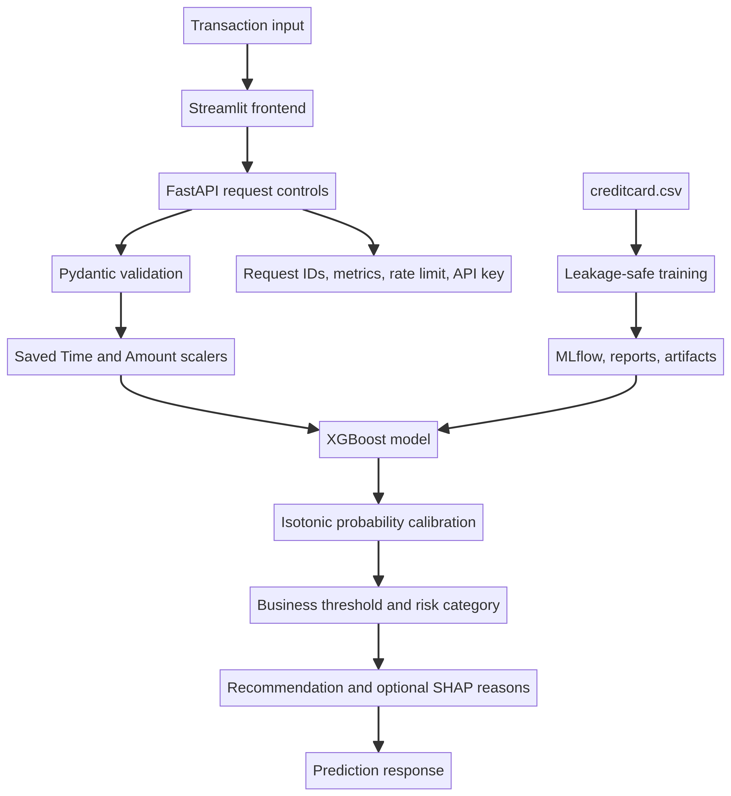

# Fraud Detection System

This repository contains a complete fraud-risk product rather than only a notebook model. It includes a leakage-safe XGBoost training pipeline, calibrated probabilities, threshold and business-cost analysis, FastAPI serving, optional SHAP explanations, a minimal Streamlit frontend, Docker images, Render configuration, MLflow tracking, monitoring utilities, tests, and CI/CD checks.

## Architecture

The request path is:

```text
Streamlit → API security controls → Pydantic validation → saved preprocessing
         → XGBoost → probability calibration → risk threshold → recommendation
         → optional SHAP reasons → typed response
```



Training is isolated from serving. The raw dataset is split before any scaler is fitted. The training split is used for model fitting, a validation split is used for early stopping and threshold selection, a calibration split fits isotonic probability calibration, and the final test split is used once for reporting.

## Files

| File | Purpose |
|---|---|
| `app.py` | FastAPI service with prediction, batch, health, model information, metrics, request IDs, API-key protection, rate limiting, request-size controls, and safe errors. |
| `streamlit_app.py` | Single-column mobile-friendly UI with one transaction form and optional explanation details. |
| `train.py` | Training, calibration, metrics, threshold analysis, business cost, baseline comparisons, cross-validation, error analysis, regression fixtures, MLflow, and artifact creation. |
| `monitor.py` | KS-test drift report and missing-value/distribution monitoring. |
| `load_test.py` | Concurrent API latency, throughput, and error-rate check. |
| `tests/test_api.py` | Mock-based API tests, including validation, batch requests, metrics, request IDs, authentication, and model-unavailable behavior. |
| `tests/test_regression.py` | Optional fixture-based prediction regression test after training. |
| `Dockerfile` | FastAPI image with non-root execution and verified artifact startup. |
| `Dockerfile.streamlit` | Streamlit image. |
| `scripts/fetch_artifacts.py` | HTTPS and SHA-256 verified model-artifact download utility. |
| `entrypoint.sh` | Fetches optional artifacts and starts the API. |
| `render.yaml` | Two-service Render blueprint. |
| `ci-cd.yml` | Compilation, lint, tests, and API/frontend Docker builds. |
| `DEPLOYMENT.md` | Full deployment and operations guide. |

The original instructional PDFs are retained in the repository as reference material. Model binaries and datasets are intentionally not committed.

## Requirements

Use Python 3.11 for the pinned dependency set. Create a virtual environment and install the requirements:

```bash
python3.11 -m venv .venv
. .venv/bin/activate
pip install -r requirements.txt
```

## Train the model

Place the source CSV at `data/creditcard.csv`. It must contain `Time`, `V1` through `V28`, `Amount`, and binary `Class` columns. Then run:

```bash
python train.py
```

The training script generates these runtime files:

```text
models/fraud_model.pkl
models/amount_scaler.pkl
models/time_scaler.pkl
models/probability_calibrator.pkl
models/threshold.pkl
models/metadata.json
```

It also generates `outputs/threshold_analysis.csv`, `outputs/business_cost_curve.csv`, `outputs/calibration_curve.png`, `outputs/baseline_comparison.csv`, `outputs/error_analysis.csv`, `outputs/error_analysis_summary.csv`, `outputs/classification_report.json`, and `outputs/regression_fixtures.csv`.

The production model uses XGBoost `scale_pos_weight`. SMOTE, random over-sampling, random under-sampling, and combined SMOTE/under-sampling are used only in the comparison experiments. SMOTE is never combined with `scale_pos_weight` for the same model.

## Run locally

Start the API:

```bash
uvicorn app:app --host 0.0.0.0 --port 8000
```

Start Streamlit in another terminal:

```bash
FRAUD_API_URL=http://localhost:8000 streamlit run streamlit_app.py
```

The API starts in degraded mode when artifacts are missing. In that state, `/health` reports `model_loaded: false` and prediction requests return a controlled HTTP 503 response.

## API contract

The original feature contract is preserved. Features must be ordered as `[Time, V1, V2, ..., V28, Amount]` and contain exactly 30 finite numbers.

```json
{
  "transaction_id": "tx_001",
  "features": [0, 0, 0, 0, 0, 0, 0, 0, 0, 0, 0, 0, 0, 0, 0, 0, 0, 0, 0, 0, 0, 0, 0, 0, 0, 0, 0, 0, 0, 25.5]
}
```

Useful routes are shown below.

| Method | Route | Purpose |
|---|---|---|
| `GET` | `/` | Service links and status. |
| `GET` | `/health` | Readiness and model-loaded state. |
| `GET` | `/model-info` | Model version, feature order, thresholds, and training metadata. |
| `GET` | `/metrics` | Prometheus-compatible counters and average latency. |
| `POST` | `/predict` | Backward-compatible single-transaction prediction. |
| `POST` | `/api/v1/predict` | Versioned single-transaction prediction. |
| `POST` | `/predict-batch` | Up to 1,000 validated transactions. |
| `GET` | `/docs` | Swagger UI. |

A successful prediction includes the original fields plus `prediction`, `decision_threshold`, `recommended_action`, `model_version`, `explanation_available`, `top_reasons`, and `request_id`. Recommendations are advisory: low risk can be approved, medium risk can request verification, and high risk can be held or sent to manual review.

## Configuration

Copy `.env.example` and set deployment values through the platform’s secret manager. Never commit the real API key or artifact token.

| Variable | Default | Description |
|---|---|---|
| `MODEL_DIR` | `models` | Model artifact directory. |
| `MODEL_VERSION` | `xgboost-v1.0.0` | Version returned by the API. |
| `DECISION_THRESHOLD` | `0.50` | Fallback threshold before trained `threshold.pkl` is loaded. |
| `LOW_RISK_THRESHOLD` | `0.30` | Upper boundary for low risk. |
| `HIGH_RISK_THRESHOLD` | `0.70` | Lower boundary for high risk. |
| `API_KEY` | empty | If set, requires `X-API-Key` on every route. |
| `CORS_ORIGINS` | `*` | Comma-separated allowed browser origins; restrict in production. |
| `RATE_LIMIT_PER_MINUTE` | `120` | Per-process client request limit. |
| `MAX_REQUEST_BODY_BYTES` | `1000000` | Request body size limit. |
| `SYNC_THREAD_TOKENS` | `100` | AnyIO thread capacity for synchronous prediction handlers. Tune with load tests. |
| `MAX_INFLIGHT_REQUESTS` | `100` | Non-blocking admission limit; excess requests receive 429 instead of accumulating queue latency. |
| `PREDICTION_LOGGING` | `false` | Enables per-prediction logs; keep off for high-throughput serving unless required. |
| `ENABLE_SHAP` | `false` | Enables optional local SHAP reasons. |
| `FRAUD_API_URL` | `http://localhost:8000` | Streamlit backend URL. |
| `MODEL_ARTIFACT_URL` | empty | Immutable private HTTPS ZIP URL for model files. |
| `MODEL_ARTIFACT_SHA256` | empty | Expected SHA-256 digest of the artifact ZIP. |
| `MODEL_ARTIFACT_TOKEN` | empty | Optional bearer token for private storage. |

## Validation and monitoring

Run the quality checks locally:

```bash
python -m compileall -q app.py train.py streamlit_app.py monitor.py load_test.py tests
pytest tests/ -v --tb=short
```

After the API is running, measure performance with:

```bash
python load_test.py --url http://localhost:8000 --requests 100 --workers 10
```

Run distribution-drift analysis with a production export containing the same feature columns:

```bash
python monitor.py --reference data/creditcard.csv --production data/production_scored.csv
```

The API’s `/metrics` endpoint should be scraped by the chosen monitoring platform. In multi-replica deployments, replace the process-local counters and rate limiter with shared infrastructure.

## Docker

Build and run the API after the model artifacts exist:

```bash
docker build -f Dockerfile -t fraud-api:latest .
docker run --rm -p 8000:8000 \
  -e API_KEY='replace-with-a-secret' \
  -e CORS_ORIGINS='http://localhost:8501' \
  fraud-api:latest
```

The API entrypoint downloads an artifact ZIP only when `MODEL_ARTIFACT_URL` is set. The URL must use HTTPS, and `MODEL_ARTIFACT_SHA256` should be set for integrity verification.

Build and run the frontend:

```bash
docker build -f Dockerfile.streamlit -t fraud-streamlit:latest .
docker run --rm -p 8501:8501 \
  -e FRAUD_API_URL='http://host.docker.internal:8000' \
  -e API_KEY='replace-with-the-same-secret' \
  fraud-streamlit:latest
```

## Render

Push the repository to GitHub, create services from `render.yaml`, and configure the secret values in Render. The API service requires either model files in the build context or an immutable private artifact URL plus its SHA-256 digest. The Streamlit service requires the deployed API URL and the same API key. Set the API’s `CORS_ORIGINS` to the exact Streamlit origin.

After deployment, verify `/health` returns `model_loaded: true`, open `/docs`, inspect `/model-info`, inspect `/metrics`, and submit a known test transaction through Streamlit. A healthy container without loaded artifacts is not ready for predictions.

## Results

Trained and evaluated on the Kaggle `mlg-ulb/creditcardfraud` dataset (train/validation/calibration/test split, no leakage).

| Metric | Value |
|---|---|
| ROC-AUC | 0.963 |
| Recall | 81% |
| Precision | 67% |
| Decision threshold | 0.065 |

The threshold was selected via business-cost analysis (see `outputs/threshold_analysis.csv` and `outputs/business_cost_curve.csv`) rather than the default 0.50, to reflect the asymmetric cost of missed fraud vs. false positives.

## Live Demo

- API: `https://fraud-detection-api-ulr2.onrender.com` — see `/docs` for interactive Swagger UI, `/health` for status, `/model-info` for model metadata.
- Frontend: `https://fraud-streamlit.onrender.com`

> Note: Render free tier spins down on inactivity — first request after idle may take 30–60s to respond.

## Example Request

```bash
curl -X POST https://<your-fraud-api>.onrender.com/predict \
  -H "Content-Type: application/json" \
  -H "X-API-Key: <your-api-key>" \
  -d '{
    "transaction_id": "tx_001",
    "features": [0, 0, 0, 0, 0, 0, 0, 0, 0, 0, 0, 0, 0, 0, 0, 0, 0, 0, 0, 0, 0, 0, 0, 0, 0, 0, 0, 0, 0, 25.5]
  }'
```

Response:

```json
{
  "transaction_id": "tx_001",
  "prediction": 0.0123,
  "decision_threshold": 0.065,
  "recommended_action": "approve",
  "model_version": "xgboost-v1.0.0",
  "explanation_available": false,
  "top_reasons": [],
  "request_id": "..."
}
```

## CI/CD

The workflow runs on pushes and pull requests targeting `main`. It compiles Python files, installs dependencies, runs linting, executes API tests, builds the API container, builds the Streamlit container, and optionally pushes tagged images on a main-branch push. Configure `DOCKER_USERNAME` and `DOCKER_PASSWORD` only if Docker Hub publishing is required.

## Limitations

The project’s historical anonymized data cannot prove future production performance. The model is a decision-support component and should be integrated with human review, chargeback labels, drift monitoring, and an approved risk policy. Process-local metrics and rate limiting are suitable for a single instance but must be externalized for multiple replicas. The original archive did not include the dataset or trained model artifacts, so live deployment and model-quality results require the operator to provide those files.
